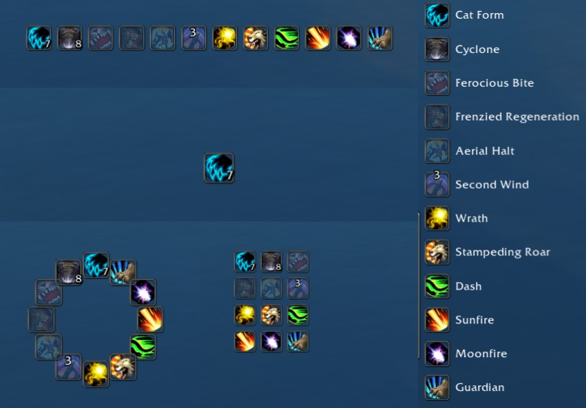
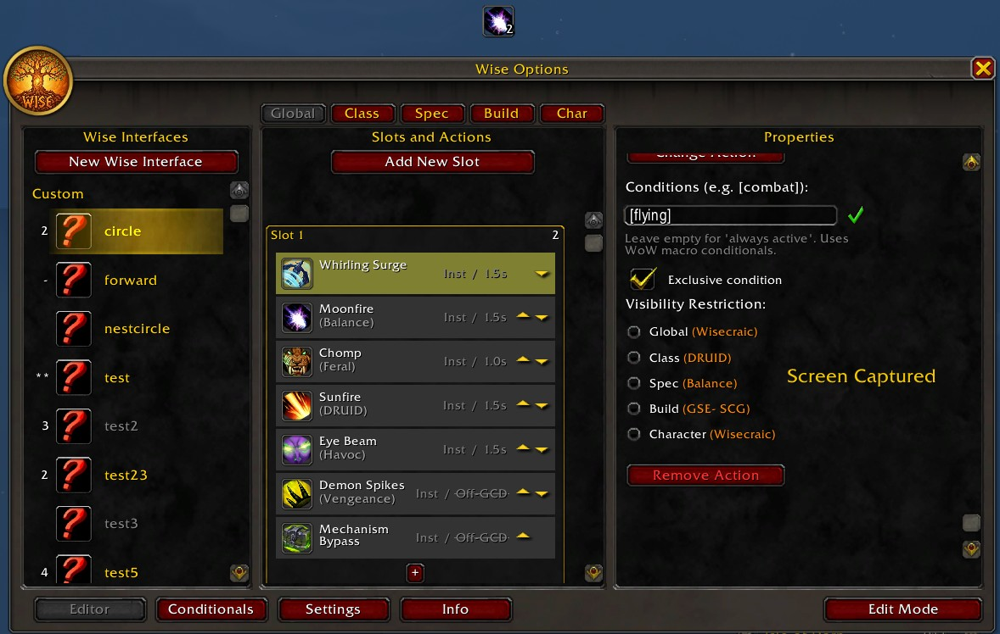
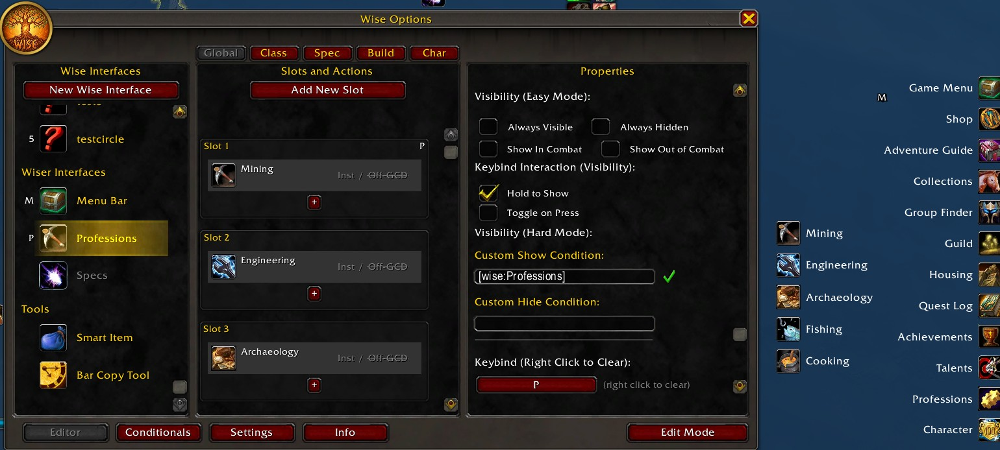
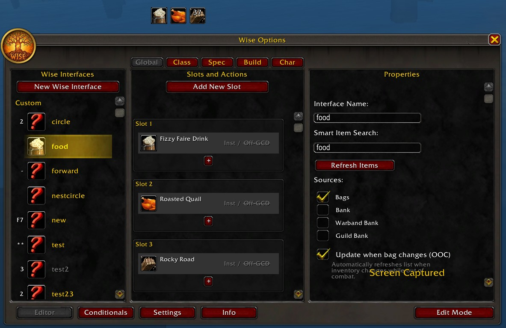
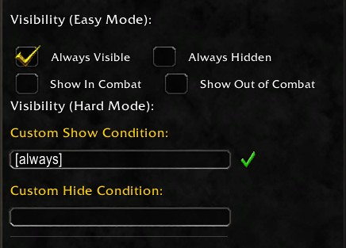

# Wise Addon

## What is Wise?

Wise is a flexible action bar addon for World of Warcraft (Retail 11.0+).

What sets Wise apart is that there are no individual profiles for different toons, no loading/copying profiles across toons, no dragging spell icons or macros, none of that.  You configure it once and it lives across all your toons.  
*   Have 10 fire mages that you want the same buttons to do the same thing every time?  Wise.  
*   Have a druid that you don't want to have to configure every button depending on which form you're in every time your bar changes? Wise.
*   Want to hide all your bars based on a condition, or two, of your choosing, or not?  Wise.
*   Want your flying/mount/toys key bindings to be the same on every toon you have, even if you just created it?  Wise.
*   Want to have dynamically adjusting item bars/buttons based on what you have in your bags and across all toons?  Wise.

**Wise** lets you create:
*   **Lines:"** Action bars, essentially
*   **Circles:** Because Fitts's Law is a thing, even if I'm too busy to explain it.
*   **Action Bars (Boxes):** For when you're feeling square.
*   **Lists:** Sometimes you just want a list of things. I don't judge.
*   **Nested Interfaces:** Put a thing inside a thing. thing-ception.
*   **Context-Sensitive Slots:** Show *this* spell if you're a Fire Mage, show *that* item if you're on your alt.

## Features (The "Why Should I Care?" Section)

### 1. Layout Variety
Make what you want! Wise supports:
*   **Circle:** The classic ring. Customizable radius and rotation.
*   **Box:** A grid. Like a normal action bar, but betterin box form.  Rows and columns
*   **Line:** A single row or column, not both.  See above
*   **List:** Text-heavy list for when you want to read.
*   **Button:** Just a single button. Revolutionary.

*   All of these can be static or dynamic, so if you want something that changes as your toon/spec/talents do, you can do that.  Want something permanent, do Static.

### 2. Ring Menus & Nested Interfaces
Most addons give you bars. Some give you rings. Wise gives you buttons, bars, circles, boxes, and lists.  Because sometimes you just want a list.

Nest custom buttons in other interfaces.  It's organizational bliss for people who have too many buttons and not enough keybinds.  **This feature is still a work in progress.**

### 3. Context-Aware Slots
Every slot in a Wise ring or bar can have multiple **States** and can be configured with conditionals, in the same way that macros work.  This allows you to have global slots that act over all of your toons (example: [flying]), and class, spec, talent, and character-specific slots depending on how you want to configure it.

*   **State 1:** Cast *Whirling Surge (Only if Flying).
*   **State 1:** Cast *Moonfire* (Only if Balance Spec and Druid).
*   **State 2:** Cast *Chomp* (Only if Feral Spec and Druid).
*   **State 4:** Cast *Eye Beam* (Only if Havoc Death Knight).
*   **State 5:** Use *Mechanism Bypass* (If holding shift).

It's very similar to macros.  HOWEVER, if you wanted setup 13 different characters with a macro similar to the setup above, you would have to have 13 different macros.  Every time you created a different toon, you'd have to find the macro, drag it to you bar... you get the point.  Or if you had other addons that copy profiles you would have to find the profile, make sure you were copying the correct one... This doesn't seem like the best way to do things.  Wise you configure once and it lives across all your toons.

### 4. "Wiser" Interfaces
Because your interface should change when you do, Wise has special modules that let you configure your interface once and it lives across all your toons.  No need to manually configure the things that are easily fetchable.

*   **Professions:** Auto-populates with your current character's skills.
*   **Menu Bar:** Replaces that tiny micro-menu with a big, clickable ring, list, or box.  You make it how you want to make it
*   **Specs:** Quick switch between specs without opening the talent pane.  Auto updates when you change specs, or when you change toons.
*   **Cooldowns & Utilities:** Because tracking cooldowns is hard. **Work in progress and hidden for now!**

### 5. Smart Items (Requires Syndicator/Baganator)
I have bags full of junk. I don't want to manually drag every potion onto a bar. Wise lets you create a **Smart Interface** based on a search term.

*   Type "potion" -> Creates a ring with all your potions.
*   Type "hearthstone" -> Creates a ring with all your teleport items.
*   **Auto-Update:** It refreshes automatically when you loot new stuff (out of combat, because Blizzard says so).

### 6. Visibility Control (Easy vs. Hard Mode)
Hate writing Lua conditions. So Wise has checkboxes for the easy stuff.
*   **Easy Mode:** Check "Combat", "Out of Combat", "Hold to Show", etc.
*   **Hard Mode:** You can write custom macro conditionals like `[mod:shift, @target, harm]`. But you don't have to.

### 7. Macros 
The default macro editor is... limited. Wise can add *any number* of macros that you want.  They aren't tied to the in game macros.  Wise's editor has syntax highlighting (well, it colors spell names blue if they exist, and red if you typo'd them). It's the little things. **Also a WIP**

## Power User Stuff

*   **Custom Conditionals:** Wise adds extra conditionals like `[mercenary]` and `[guildbank]` so you can show specific rings only when you're at the bank.
*   **Edit Mode:** Toggle Edit Mode to drag your rings and bars around visually. No more guessing X/Y coordinates.  Works with the built in edit mode, and has nudgers.
*   **Import/Export:** Share your complex nested mage portal ring with your friends. They won't appreciate it, but you can try.

## Comparison (Or: Why Not Use X?)

Let me be clear: The addons listed below are masterpieces. Their authors are legends. Wise is an alternative vision.

### vs. OPie
**OPie** is the GOAT of ring menus. It's stable, efficient, and handles everything perfectly.
*   **Why Wise?** This addon actually started from modifying OPie to get the functionality I wanted.  What I wanted quickly diverged from OPie's vision, and I found that I needed to make my own thing.

### vs. GSE (Gnome Sequencer Enhanced)
**GSE** is a powerhouse for one-button rotation macros. It's basically a programming language for DPS.
*   **Why Wise?** After years of programming GSE, I realized that I was only really using 2 or 3 macros in a loop.  Sure, min/maxers were doing complex count loops and rotations, but even after trying their implementations I found that I was doing nearly as much *insert role here* by swapping between 2 or 3 macros to keep cooldowns up.  With single button assistant and assisted highlight, the want to maintain complex rotations for .5% is nah.  

### vs. Bartender / Dominos / ElvUI
These are the standard for action bars. They work. They are solid.
*   **Why Wise?** It's not those.  It's not trying to be those.  It's trying to be something else. And also, I don't want to have to setup bars or profiles across any of my toons.  Setup some flight stuff, and it's there for all my toons, every time.

## Disclaimer

The Options Window is a work in progress, making it easier to handle is on the roadmap.  
There will be bugs, I'm very new to this and also, it's a very new addon

## Roadmap
* Version 1.0.[date code] - **we are here**
* bug fixes
* Version 1.1.[date code] Make the options window better - it currently sucks
* bug fixes\
* Version 1.2.[date code] Make the annimations smooth.  They aren't polished, and it looks jank.
* we'll see

This is my daily driver addon for my buttons and the performant part of my user interface.  Things will be in motion, cause I notice things that are wrong and I want to fix them.

## Installation

1.  Download.
2.  Put in `Interface/AddOns/Wise`
3.  Follow the demo to learn how to use it.
